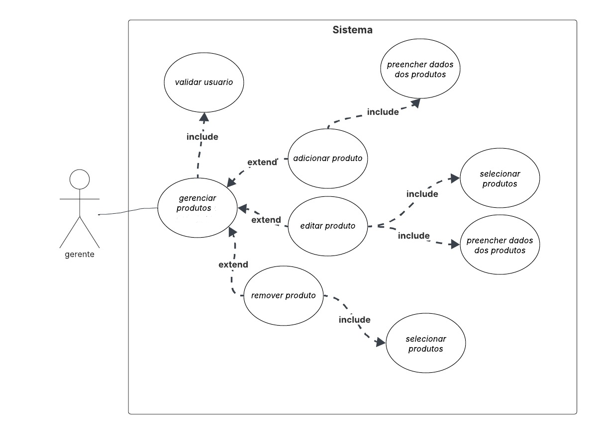
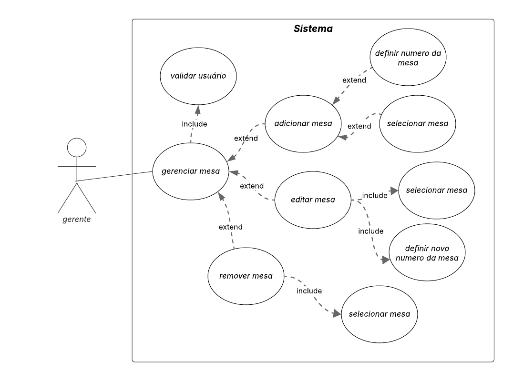

# Especificação do projeto

Definição do problema e ideia de solução a partir da perspectiva do usuário. É composta pela definição do  diagrama de personas, histórias de usuários, requisitos funcionais e não funcionais além das restrições do projeto.

Apresente uma visão geral do que será abordado nesta parte do documento, enumerando as técnicas e/ou ferramentas utilizadas para realizar a especificações do projeto.

## Personas

### João, o Gestor;
- Idade: 45 anos;
- Perfil: Proprietário de um restaurante de médio porte, preocupado com eficiência operacional e controle de custos;
- Desafios: Gerenciar pedidos, evitar desperdícios, monitorar desempenho da equipe e garantir qualidade no atendimento;
- Necessidades: Um sistema que facilite a supervisão de processos, forneça dados em tempo real e permita um controle melhor do estoque e das vendas.

### Carlos, o Garçom
- Idade: 28 anos;
- Perfil: Profissional experiente, com cinco anos no setor, busca agilidade no atendimento e satisfação dos clientes;
- Desafios: Anotar pedidos corretamente, evitar erros na cozinha e gerenciar múltiplas mesas simultaneamente;
- Necessidades: Um sistema rápido e intuitivo para registrar pedidos e comunicar-se com a cozinha sem precisar de papel.

### Ana, a Cozinheira
- Idade: 35 anos;
- Perfil: Responsável pela execução dos pratos conforme os pedidos e padrões do restaurante;
- Desafios: Gerenciar fluxo de pedidos, evitar desperdício e manter a qualidade dos pratos, principalmente em horários de pico;
- Necessidades: Uma interface clara para visualizar os pedidos em tempo real e organizar melhor o tempo de preparo.

### Pedro, o Cliente
- Idade: 32 anos;
- Perfil: Profissional que almoça fora frequentemente e busca um atendimento rápido e eficiente;
- Desafios: Tempo limitado para refeições e espera excessiva por atendimento;
- Necessidades: Uma forma fácil de visualizar o cardápio, fazer pedidos rapidamente e pagar sem demora;

## Histórias de usuários

Com base na análise das personas, foram identificadas as seguintes histórias de usuários:

| EU COMO... `PERSONA`   | QUERO/PRECISO... `FUNCIONALIDADE`                                                                 | PARA... `MOTIVO/VALOR`                                                                 |
|-------------------------|---------------------------------------------------------------------------------------------------|---------------------------------------------------------------------------------------|
| **Gestor**              | Acessar relatórios de vendas e consumo com filtros (diário/semanal/mensal, categoria, horário)   | Tomar decisões estratégicas (ex: avaliar desempenho, definir compras de insumos).     |
| **Garçom**              | Registrar pedidos rapidamente com opções de modificação (ex: sem cebola)                         | Agilizar o atendimento e evitar erros no envio de pedidos para a cozinha.             |
| **Cozinheira**          | Visualizar pedidos em ordem cronológica com status de preparo (ex: "Em andamento", "Pronto")     | Organizar a produção e priorizar a preparação dos pratos conforme demanda.            |
| **Cliente**             | Visualizar cardápio digital via QR Code e realizar pedidos/pagamentos pelo celular               | Evitar filas e agilizar o processo de pedido/pagamento para uma experiência rápida.   |

## Requisitos

---

### Requisitos Funcionais

| ID     | Descrição do Requisito                                                                 | Prioridade |
|--------|----------------------------------------------------------------------------------------|------------|
| RF-001 | O gerente deve ser capaz de gerenciar os produtos. | ALTA       |
| RF-002 | O gerente deve ser capaz de gerenciar as categorias de produtos. | ALTA       |
| RF-003 | O funcionário deve ser capaz de gerenciar os pedidos. | ALTA       |
| RF-004 | O gerente deve ser capaz de visualizar relatórios de pedidos por data ou períodos personalizados. | MÉDIA       |
| RF-005 | O gerente deve ser capaz de gerenciar o acesso dos funcionários no sistema. | ALTA      |
| RF-006 | O gerente deve ser capaz de gerenciar as mesas do restaurante | ALTA       |
| RF-007 | O sistema deve permitir a impressão de contas e relatórios. | MÉDIA      |

---

### Requisitos Não Funcionais

| ID      | Descrição do Requisito                                                                 | Prioridade |
|---------|----------------------------------------------------------------------------------------|------------|
| RNF-001 | O sistema deve suportar múltiplos acessos simultâneos sem degradação perceptível de desempenho | ALTA       |
| RNF-002 | O sistema deve possuir uma interface gráfica simples, intuitiva e adequada ao ambiente de uso. | ALTA       |
| RNF-003 | O sistema deve proteger os dados sensíveis do sistema utilizando criptografia segura. | ALTA       |
| RNF-004 | O sistema precisa ser responsivo, isto é, deve funcionar adequadamente em aparelhos móveis (como smartphones e tablets) e em computadores de mesa. | ALTA       |
| RNF-005 | O sistema precisa de um sistema de backup e recuperação de dados automático, para prevenir a perda de dados relevantes. | ALTA      |
| RNF-006 | O sistema deve manter registros de operações administrativas para auditoria e resolução de problemas. | MÉDIA       |
| RNF-007 | O sistema deve ser otimizado para rodar em servidores com recursos limitados, garantindo boa performance em ambientes com hardwares modestos. | ALTA      |

---

### Restrições

| ID  | Restrição                                                                               |
|-----|-----------------------------------------------------------------------------------------|
| 001 | O sistema deve permitir a edição do menu apenas fora do fluxo ativo de criação/atualização de pedidos para evitar inconsistências. |
| 002 | O  sistema deve assegurar que a remoção de categorias exclua todos os produtos associados, mediante confirmação explícita do usuário. |
| 003 | O sistema deve aplicar restrições de acesso conforme permissões configuradas nos usuários. |
| 004 | O sistema deve permitir apenas criação de pedidos que tenham pelo menos um item registrado. |
| 005 | A impressão de contas e relatórios deve estar nitegrada diretamente oa sistema, com formato padronizado. |
| 006 | Atualizações no menu devem ser refletidas imediatamente em todas as telas do sistema. |

### Diagrama de caso de uso

#### RF-001

#### RF-002

#### RF-003

#### RF-004

#### RF-005

#### RF-006

#### RF-007

 
