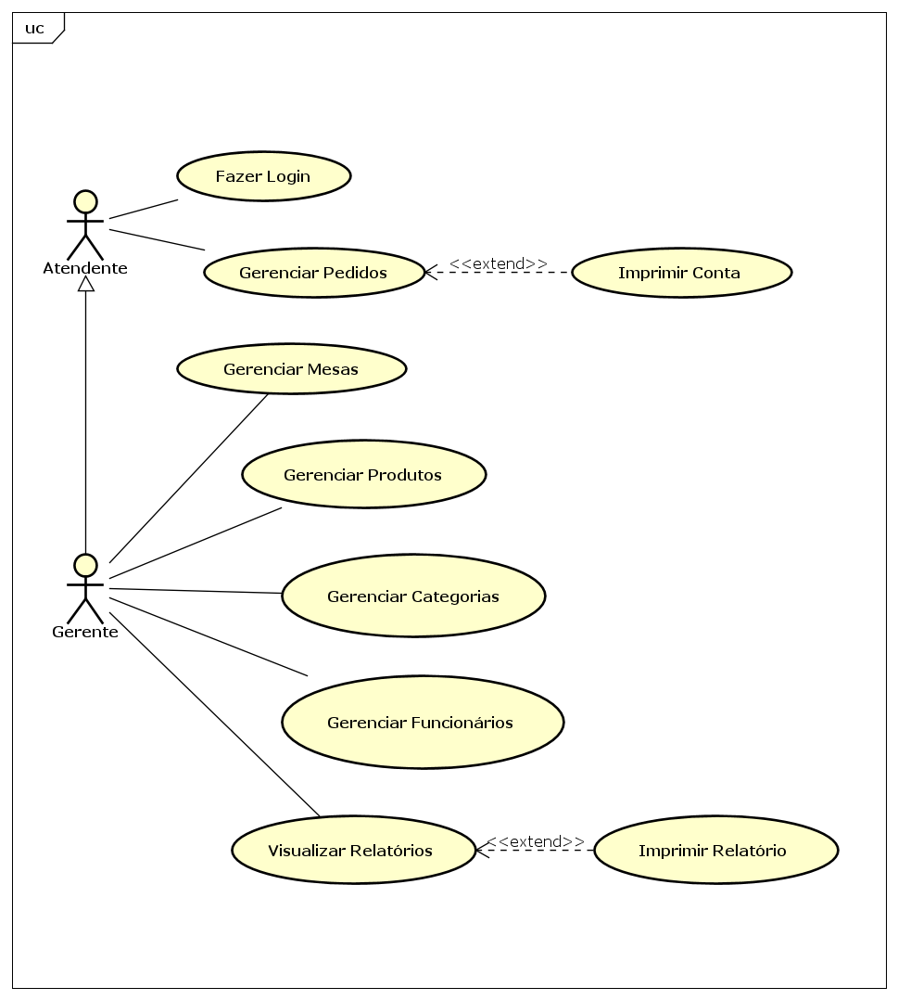

# Especificação do projeto

## Personas

### Roberto, o Gerente
- Idade: 48 anos;
- Perfil: Proprietário do restaurante, focado na gestão estratégica e financeira. Ele precisa de dados consolidados para tomar decisões assertivas sobre o negócio.
- Desafios: Manter o cardápio e os preços sempre atualizados no sistema, treinar novos funcionários para usar a ferramenta corretamente e garantir que os dados financeiros sejam precisos para o fechamento do mês.
- Necessidades: Um painel de controle com acesso a relatórios detalhados e ferramentas simples para gerenciar os produtos vendidos.

### Carlos, o Garçom
- Idade: 26 anos;
- Perfil: Profissional ágil e comunicativo, responsável por atender os clientes nas mesas. Sua prioridade é a rapidez e a precisão no registro dos pedidos.
- Desafios: Anotar pedidos complexos com modificações e gerenciar várias mesas simultaneamente, principalmente em horários de pico.
- Necessidades: Uma interface intuitiva e rápida para lançar itens, adicionar observações e enviar os pedidos para a cozinha sem erros.

### Lúcia, a Atendente de Caixa
- Idade: 38 anos;
- Perfil: Organizada e metódica, sua função é finalizar a experiência do cliente, garantindo que a cobrança seja feita de forma correta e sem demora.
- Desafios: Evitar filas no caixa, conferir rapidamente todos os itens de um pedido longo e aplicar taxas de serviço corretamente.
- Necessidades: Um sistema que permita localizar facilmente o pedido de uma mesa e gerar uma conta clara e formatada para impressão imediata.

### Sandra, a Cozinheira
- Idade: 42 anos;
- Perfil: Chefe de cozinha experiente, responsável por garantir a qualidade e a padronização dos pratos. Ela trabalha sob pressão para manter o fluxo da cozinha.
- Desafios: Interpretar corretamente as comandas, especialmente as observações (ponto da carne, alergias, ingredientes a remover) e organizar a fila de preparo.
- Necessidades: Receber os pedidos de forma padronizada e legível, com todas as especificações do cliente bem destacadas para evitar erros na produção.

## Histórias de usuários

Com base na análise das personas, foram identificadas as seguintes histórias de usuários:

| EU COMO... `PERSONA` | QUERO/PRECISO... `FUNCIONALIDADE` | PARA... `MOTIVO/VALOR` |
| :--- | :--- | :--- |
| Gerente | Gerar relatórios de vendas consolidados por período | Analisar o desempenho financeiro do restaurante e tomar decisões estratégicas. |
| | Adicionar e editar os produtos do cardápio no sistema | Manter o menu sempre atualizado para que os pedidos sejam registrados com os preços e itens corretos. |
| Garçom | Lançar e atualizar os pedidos de uma mesa de forma rápida e intuitiva | Agilizar o atendimento ao cliente e minimizar a chance de erros na comunicação com a cozinha. |
| Atendente de Caixa | Acessar um pedido e imprimir a conta final detalhada | Realizar o fechamento da conta de forma ágil e transparente, evitando filas no caixa. |
| Cozinheira | Receber a comanda com os itens e observações de forma clara e padronizada | Preparar os pratos exatamente como o cliente solicitou, garantindo a qualidade e a satisfação. |

## Requisitos

---

### Requisitos Funcionais

| ID      | Funcionalidade               | Descrição                                                                                                                         | 
|---------|------------------------------|-----------------------------------------------------------------------------------------------------------------------------------|
| RF-001  | Fazer Login                  | Processo de Autenticação do Usuário para Entrada no Sistema.                                                                      |
| RF-002  | Gerenciar Pedidos            | Processamento de Visualização, Inclusão, Alteração, Exclusão e Fechamento de Pedidos, incluindo itens, quantidades e observações. |
| RF-003  | Imprimir Contas              | Geração e Envio para Impressão de uma Conta detalhada de um Pedido Fechado                                                        |
| RF-004  | Gerenciar Mesas              | Processamento de Inclusão, Alteração, Exclusão e Consulta de Mesas do Restaurante.                                                |
| RF-005  | Gerenciar Produtos           | Processamento de Inclusão, Alteração, Exclusão e Consulta de Produtos.                                                            |
| RF-006  | Gerenciar Categorias         | Processamento de Inclusão, Alteração, Exclusão e Consulta de Categorias de Produtos                                               |
| RF-007  | Gerenciar Funcionários       | Processamento de Inclusão, Alteração, Exclusão e Consulta de Funcionários, incluindo a Definição de Permissões de Acesso.         |
| RF-008  | Visualizar Relatórios        | Exibição de um Relatório Consolidado de Todos os Pedidos em um Dia ou Período específico                                          |
| RF-009  | Imprimir Contas e Relatórios | Geração e Envio para Impressão de Relatórios Diários ou por Período em Formato adequado                                           |

---

### Requisitos Não Funcionais

| ID        | Restrição        | Descrição                                                                                                                                          |
|-----------|------------------|----------------------------------------------------------------------------------------------------------------------------------------------------|
| RNF-001   | Desempenho       | O sistema deve suportar múltiplos acessos simultâneos sem degradação perceptível de desempenho                                                     |
| RNF-002   | Usabilidade      | O sistema deve possuir uma interface gráfica simples, intuitiva e adequada ao ambiente de uso.                                                     |
| RNF-003   | Segurança        | O sistema deve proteger os dados sensíveis do sistema utilizando criptografia segura.                                                              |
| RNF-004   | Portabilidade    | O sistema precisa ser responsivo, isto é, deve funcionar adequadamente em aparelhos móveis (como smartphones e tablets) e em computadores de mesa. |
| RNF-005   | Confiabilidade   | O sistema precisa de um sistema de backup e recuperação de dados automático, para prevenir a perda de dados relevantes.                            |
| RNF-006   | Manutenibilidade | O sistema deve manter registros de operações administrativas para auditoria e resolução de problemas                                               |
| RNF-007   | Desempenho       | O sistema deve ser otimizado para rodar em servidores com recursos limitados, garantindo boa performance em ambientes com hardwares modestos.      |

---

### Restrições

| ID      | Restrição                                                                                                                            |
|---------|--------------------------------------------------------------------------------------------------------------------------------------|
| 001     | O sistema deve permitir a edição do menu apenas fora do fluxo ativo de criação/atualização de pedidos para evitar inconsistências.   |
| 002     | O sistema deve assegurar que a remoção de categorias exclua todos os produtos associados, mediante confirmação explícita do usuário. |
| 003     | O sistema deve aplicar restrições de acesso conforme permissões configuradas nos usuários.                                           |
| 004     | O sistema deve permitir apenas criação de pedidos que tenham pelo menos um item registrado.                                          |
| 005     | A impressão de contas e relatórios deve estar nitegrada diretamente oa sistema, com formato padronizado.                             |
| 006     | Atualizações no menu devem ser refletidas imediatamente em todas as telas do sistema.                                                |

---

### Diagrama de caso de uso

