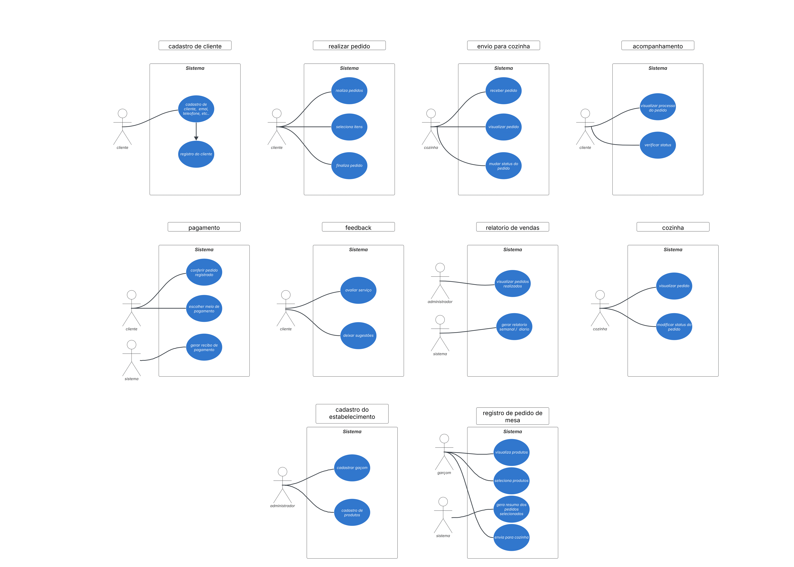

# Especificação do projeto

Pré-requisitos: <a href="01-Contexto.md"> Documentação de contexto</a>

Definição do problema e ideia de solução a partir da perspectiva do usuário. É composta pela definição do  diagrama de personas, histórias de usuários, requisitos funcionais e não funcionais além das restrições do projeto.

Apresente uma visão geral do que será abordado nesta parte do documento, enumerando as técnicas e/ou ferramentas utilizadas para realizar a especificações do projeto.

## Personas

### João, o Gestor;
- Idade: 45 anos;
- Perfil: Proprietário de um restaurante de médio porte, preocupado com eficiência operacional e controle de custos;
- Desafios: Gerenciar pedidos, evitar desperdícios, monitorar desempenho da equipe e garantir qualidade no atendimento;
- Necessidades: Um sistema que facilite a supervisão de processos, forneça dados em tempo real e permita um controle melhor do estoque e das vendas.

### Carlos, o Garçom
- Idade: 28 anos;
- Perfil: Profissional experiente, com cinco anos no setor, busca agilidade no atendimento e satisfação dos clientes;
- Desafios: Anotar pedidos corretamente, evitar erros na cozinha e gerenciar múltiplas mesas simultaneamente;
- Necessidades: Um sistema rápido e intuitivo para registrar pedidos e comunicar-se com a cozinha sem precisar de papel.

### Ana, a Cozinheira
- Idade: 35 anos;
- Perfil: Responsável pela execução dos pratos conforme os pedidos e padrões do restaurante;
- Desafios: Gerenciar fluxo de pedidos, evitar desperdício e manter a qualidade dos pratos, principalmente em horários de pico;
- Necessidades: Uma interface clara para visualizar os pedidos em tempo real e organizar melhor o tempo de preparo.

### Pedro, o Cliente
- Idade: 32 anos;
- Perfil: Profissional que almoça fora frequentemente e busca um atendimento rápido e eficiente;
- Desafios: Tempo limitado para refeições e espera excessiva por atendimento;
- Necessidades: Uma forma fácil de visualizar o cardápio, fazer pedidos rapidamente e pagar sem demora;

## Histórias de usuários

Com base na análise das personas, foram identificadas as seguintes histórias de usuários:

| EU COMO... `PERSONA`   | QUERO/PRECISO... `FUNCIONALIDADE`                                                                 | PARA... `MOTIVO/VALOR`                                                                 |
|-------------------------|---------------------------------------------------------------------------------------------------|---------------------------------------------------------------------------------------|
| **Gestor**              | Acessar relatórios de vendas e consumo com filtros (diário/semanal/mensal, categoria, horário)   | Tomar decisões estratégicas (ex: avaliar desempenho, definir compras de insumos).     |
| **Garçom**              | Registrar pedidos rapidamente com opções de modificação (ex: sem cebola)                         | Agilizar o atendimento e evitar erros no envio de pedidos para a cozinha.             |
| **Cozinheira**          | Visualizar pedidos em ordem cronológica com status de preparo (ex: "Em andamento", "Pronto")     | Organizar a produção e priorizar a preparação dos pratos conforme demanda.            |
| **Cliente**             | Visualizar cardápio digital via QR Code e realizar pedidos/pagamentos pelo celular               | Evitar filas e agilizar o processo de pedido/pagamento para uma experiência rápida.   |

## Requisitos

---

### Requisitos Funcionais

| ID     | Descrição do Requisito                                                                 | Prioridade |
|--------|----------------------------------------------------------------------------------------|------------|
| RF-001 | O sistema deve possibilitar o registro de clientes, fornecendo dados como nome, número de telefone, endereço eletrônico e preferências alimentares (se disponível). | ALTA       |
| RF-002 | O sistema deve apresentar um menu dividido em categorias (entradas, pratos principais, sobremesas, bebidas, etc.), contendo descrições, preços e possibilidades de personalização. | ALTA       |
| RF-003 | O cliente tem a opção de escolher itens do menu e fazer pedidos diretamente no sistema, com a possibilidade de alterar opções (como mudar o ponto da carne ou optar por acompanhamentos). | ALTA       |
| RF-004 | O pedido deve ser encaminhado automaticamente para a cozinha, permitindo que os cozinheiros visualizem os itens e a personalização selecionada pelo consumidor. O sistema precisa habilitar a cozinha a sinalizar os pedidos como "em preparação" e "concluído". | ALTA       |
| RF-005 | O cliente será capaz de visualizar em tempo real o estado do seu pedido (em preparação, pronto para ser servido, etc.) no sistema. | MÉDIA      |
| RF-006 | O sistema precisa possibilitar a seleção de formas de pagamento (dinheiro, cartão de crédito, débito, e-wallet) e emitir o comprovante de pagamento. | ALTA       |
| RF-007 | O consumidor terá a oportunidade de avaliar o serviço e a qualidade dos pratos, bem como apresentar sugestões para aprimoramentos no sistema. | BAIXA      |
| RF-008 | O sistema deve informar ao cliente sobre o estado do pedido (por exemplo, pedido em elaboração, finalizado, ou quando ocorre algum atraso). | MÉDIA      |
| RF-009 | O sistema deve produzir relatórios diários, semanais e mensais de vendas, facilitando o monitoramento das preferências dos consumidores e dos produtos mais comercializados. | MÉDIA      |

---

### Requisitos Não Funcionais

| ID      | Descrição do Requisito                                                                 | Prioridade |
|---------|----------------------------------------------------------------------------------------|------------|
| RNF-001 | O sistema precisa ser capaz de lidar com um grande número de usuários ao mesmo tempo sem apresentar lentidão ou falhas, principalmente durante os períodos de maior demanda. | ALTA       |
| RNF-002 | A interface do sistema deve ser simples e intuitiva para os usuários, com uma navegação intuitiva e transparente. | ALTA       |
| RNF-003 | O sistema deve assegurar a salvaguarda de informações confidenciais dos clientes, tais como informações financeiras e pessoais, por meio de criptografia e autenticação confiável. | ALTA       |
| RNF-004 | O sistema precisa ser responsivo, isto é, deve funcionar adequadamente em aparelhos móveis (como smartphones e tablets) e em computadores de mesa. | ALTA       |
| RNF-005 | O sistema precisa de um sistema de backup e recuperação de dados automático, para prevenir a perda de dados relevantes. | MÉDIA      |
| RNF-006 | O sistema deve funcionar ininterruptamente, todos os dias da semana, com um período de inatividade mínimo, assegurando uma elevada taxa de confiabilidade. | ALTA       |
| RNF-007 | O sistema deve ser facilmente mantido e atualizado, com logs detalhados para facilitar a detecção de erros e a resolução de problemas. | MÉDIA      |

---

### Restrições

| ID  | Restrição                                                                               |
|-----|-----------------------------------------------------------------------------------------|
| 001 | O sistema precisa checar a disponibilidade dos produtos no menu em tempo real, levando em conta o inventário de ingredientes. Se um item não estiver à venda, deve ser eliminado ou marcado como indisponível. |
| 002 | O sistema tem a capacidade de estabelecer um montante mínimo para o pedido, conforme a política do restaurante, que deve ser comunicado ao cliente antes de concluir a compra. |
| 003 | O sistema deve aplicar automaticamente descontos ou promoções, se houver, conforme as condições estabelecidas (por exemplo, happy hour, combos de refeições, lealdade do cliente). |
| 004 | O sistema deve calcular um tempo estimado de preparo do pedido com base no tipo de prato, e esse tempo deve ser comunicado ao cliente. |
| 005 | Os pedidos devem ser priorizados com base na hora de chegada e no tipo de prato solicitado. Pedidos de entradas, por exemplo, devem ser processados antes dos principais. |
| 006 | O sistema pode ter restrições quanto à área de entrega ou reserva, dependendo da localização do restaurante, como a distância máxima para entrega ou a necessidade de zonas específicas de serviço. |
| 007 | O sistema deve ser compatível com gateways de pagamento específicos (ex: Stripe, PayPal, etc.), podendo haver restrições quanto à escolha dos métodos de pagamento, dependendo de acordos com parceiros de pagamento. |
| 008 | O sistema deve estar em conformidade com as regulamentações locais de proteção de dados (LGPD no Brasil, GDPR na União Europeia, etc.), especialmente em relação ao armazenamento e processamento de dados pessoais dos clientes. |
| 009 | O sistema deve permitir atualizações periódicas no cardápio, mas essas mudanças devem ser controladas para não causar problemas operacionais, como alterações inesperadas em itens durante o processo de pedido. |

### Diagrama de caso de uso

