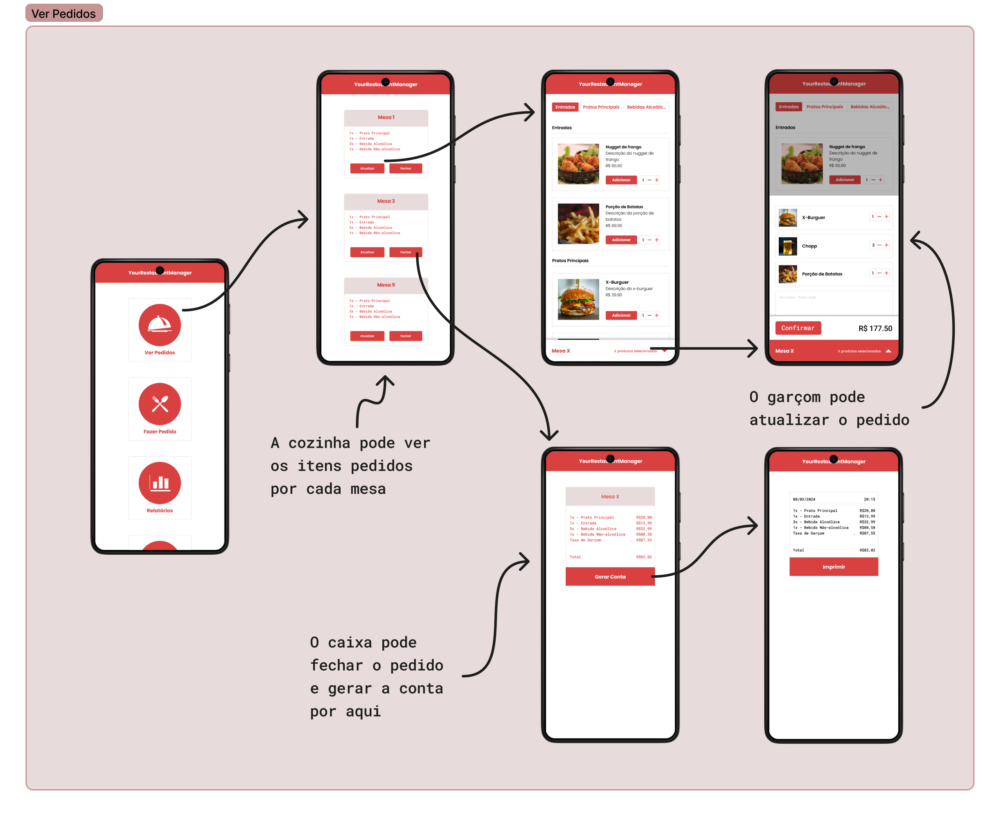
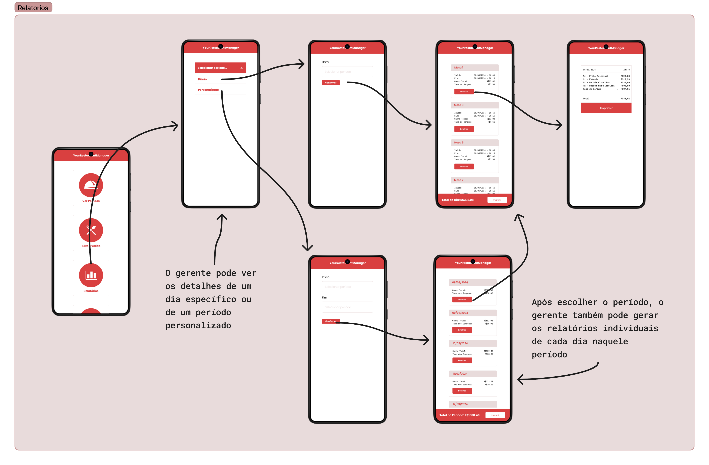
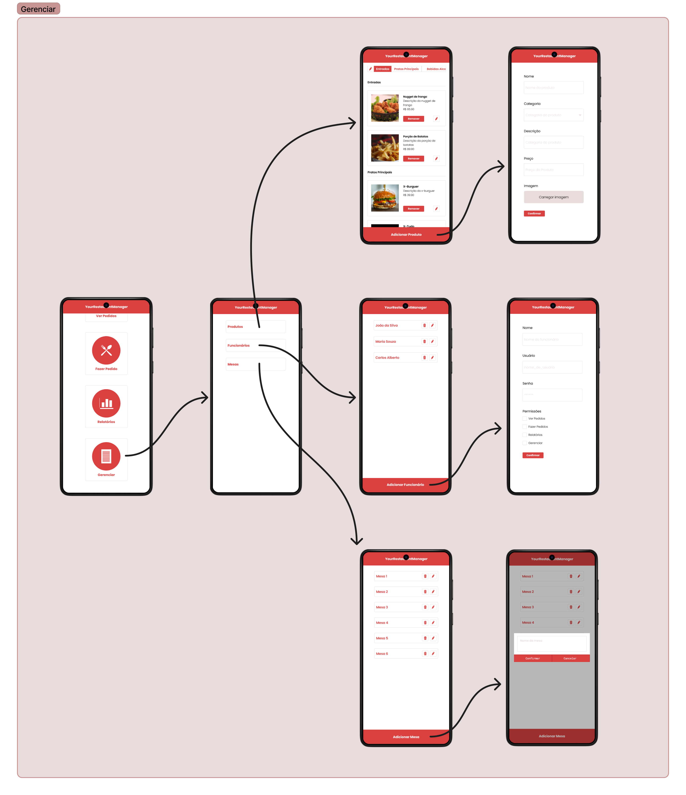

# Projeto de interface

O design da plataforma foi pensado para que ela fosse acessada de forma prática em um dispositivo mobile, o desenvolvimento foi estruturado com o mobile first em mente. O Garçom só precisa navegar entre a aba "Ver Pedidos", para atualizar o pedido de uma mesa, e a aba "Fazer Pedido", enquanto o funcionário da cozinha pode ficar apenas com a aba "Ver Pedidos" sempre aberta, acompanhando os itens necessários para cada pedido. O gerente é o único que precisará se preocupar com as abas "Relatórios" e "Gerenciar", que também têm navegações e funcionalidades simples, para diminuir a barreira de utilização para donos de pequenos estabelecimentos que nunca tiveram contato com softwares de gerenciamento.

## Protótipo Interativo

Foi desenvolvido um protótipo interativo no Figma, que simula a navegação entre as páginas do sistema, representando o fluxo dos usuários e as funcionalidades disponíveis no software. O protótipo pode ser acessado pelo link:

[Protótipo no Figma](https://www.figma.com/proto/nH6rQi0QrZbK4ZekkkOqRM/YourRestaurantManager?node-id=0-1&t=AHT5DP8cQSB2HPH7-1)

Essas são algumas imagens do protótipo para ilustrar os possíveis fluxos:

## Interface do sistema

