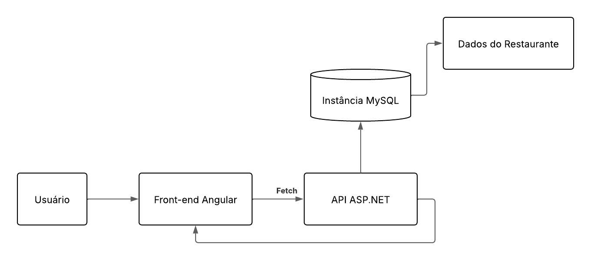

# Arquitetura da solução



## Fluxo de Atendimento

1. Garçom acessa a interface web em um dispositivo móvel.
2. Seleciona mesa e registra pedido (que o cliente escolhe pelo cardápio físico).
3. O pedido vai para a lista de pedidos
4. Os funcionários acessam a lista de pedidos e preparam o pedido do cliente
5. Os clientes pedem a conta, o caixa acessa a lista de pedidos, fecha o pedido e imprime a conta.
6. Ao final do dia o gerente gera o relatório diário e imprime.

##  Modelo de dados

O desenvolvimento da solução proposta requer a existência de bases de dados que permitam realizar o cadastro de dados e os controles associados aos processos identificados, assim como suas recuperações.

Utilizando a notação do DER (Diagrama Entidade-Relacionamento), elabore um modelo, usando alguma ferramenta, que contemple todas as entidades e atributos associados às atividades dos processos identificados. Deve ser gerado um único DER que suporte todos os processos escolhidos, visando, assim, uma base de dados integrada. O modelo deve contemplar também o controle de acesso dos usuários (partes interessadas nos processos) de acordo com os papéis definidos nos modelos do processo de negócio.

Apresente o modelo de dados por meio de um modelo relacional que contemple todos os conceitos e atributos apresentados na modelagem dos processos.

### Modelo ER

O Modelo ER representa, por meio de um diagrama, como as entidades (coisas, objetos) se relacionam entre si na aplicação interativa.

> **Links úteis**:
> - [Como fazer um diagrama entidade relacionamento](https://www.lucidchart.com/pages/pt/como-fazer-um-diagrama-entidade-relacionamento)

### Esquema relacional

O Esquema Relacional corresponde à representação dos dados em tabelas juntamente com as restrições de integridade e chave primária.
 


---

> **Links úteis**:
> - [Criando um modelo relacional - documentação da IBM](https://www.ibm.com/docs/pt-br/cognos-analytics/12.0.0?topic=designer-creating-relational-model)

### Modelo físico

Insira aqui o script de criação das tabelas do banco de dados.

Veja um exemplo:

```sql
-- Criação da tabela Medico
CREATE TABLE Medico (
    MedCodigo INTEGER PRIMARY KEY,
    MedNome VARCHAR(100)
);

-- Criação da tabela Paciente
CREATE TABLE Paciente (
    PacCodigo INTEGER PRIMARY KEY,
    PacNome VARCHAR(100)
);

-- Criação da tabela Consulta
CREATE TABLE Consulta (
    ConCodigo INTEGER PRIMARY KEY,
    MedCodigo INTEGER,
    PacCodigo INTEGER,
    Data DATE,
    FOREIGN KEY (MedCodigo) REFERENCES Medico(MedCodigo),
    FOREIGN KEY (PacCodigo) REFERENCES Paciente(PacCodigo)
);

-- Criação da tabela Medicamento
CREATE TABLE Medicamento (
    MdcCodigo INTEGER PRIMARY KEY,
    MdcNome VARCHAR(100)
);

-- Criação da tabela Prescricao
CREATE TABLE Prescricao (
    ConCodigo INTEGER,
    MdcCodigo INTEGER,
    Posologia VARCHAR(200),
    PRIMARY KEY (ConCodigo, MdcCodigo),
    FOREIGN KEY (ConCodigo) REFERENCES Consulta(ConCodigo),
    FOREIGN KEY (MdcCodigo) REFERENCES Medicamento(MdcCodigo)
);
```
Esse script deverá ser incluído em um arquivo .sql na pasta [de scripts SQL](../src/db).


## Tecnlogias utilizadas

### Front-end

| Dimensão | Tecnologias | Finalidade |
| -------- | ----------- | ---------- |
| Framework Principal | Angular | Desenvolver a lógica do front-end |
| Framework CSS | Bootstrap | Componentes pré configurados |
| Gerenciamento de estado | NgRx | Controle do estado da aplicação |
| Roteamento | Angular Routing | Navegação entre telas |
| Chamadas API | Fetch API | Comunicação com o Backend |
| IDE Recomendada | VS Code | Desenvolver com extensões para Angular/TypeScript |

### Back-end

| Dimensão | Tecnologias | Finalidade |
| -------- | ----------- | ---------- |
| Linguagem | C#          | Desenvolver a lógica de comunicação da API |
| Framework | ASP.NET     | Construção da API |
| Criptografia | Bcrypt    | Hash de criptografia para a senha do usuário |
| ORM          | Entity Framework Query | Interface com o banco de dados |
| IDE recomendado | Visual Studio | Desenvolvimento e teste |

### Banco de Dados

| Dimensão | Tecnologias | Finalidade |
| -------- | ----------- | ---------- |
| Banco Principal | MySQL | Armazenamento e relação |

## Hospedagem

| Dimensão | Tecnologias | Finalidade |
| -------- | ----------- | ---------- |
| Hospedagem Front-end | Docker Container | Acesso localmente pelo localhost |
| Hospedagem Back-end | Docker Container | Comunicação com o front-end pela rede local |
| Hospedagem do Banco de Dados | Docker Container | Hospedar o banco de dados localmente |
| Instalação | Inno Setup | Script de instalação |

- **Front-end**: Armazenado em um docker container que sobe para a porta 8080, o usuário acessa o localhost:8080 e acessa a página.
- **Back-end**: Armazenado em um docker container que sobe para a porta 5000.
- **Banco de Dados**: Armazenado em um docker container e não é exposto a porta alguma, se comunica com o back-end pela rede interna do docker.
- **Instalação**: O script de instalação instala o Docker Desktop se ele não estiver instalado, executa o docker compose com o arquivo docker-compose.yaml do projeto e gera um atalho para o localhost:8080 na tela inical. 

## Qualidade do Software

Nossa equipe priorizou 6 das 8 características da norma ISO/IEC 25010, com foco nas necessidades do nosso projeto.

| Criterio | Aplicação no projeto |
| -------- | -------------------- |
| Usabilidade | Interface intuitiva para os funcionários (Botões grandes, feedback visual claro). |
| Desempenho | Aplicação simplificada, consultas otimizadas, containerização. |
| Segurança | Banco de dados não exposto à rede. Hash de senhas. |
| Portabilidade | Software containerizado, possui as próprias dependências internamente |
| Manutenibilidade | Código modularizado, documentação da API |
| Adequação Funcional | O software resolve o problema da gestão analógica ineficiente dos restaurantes |

