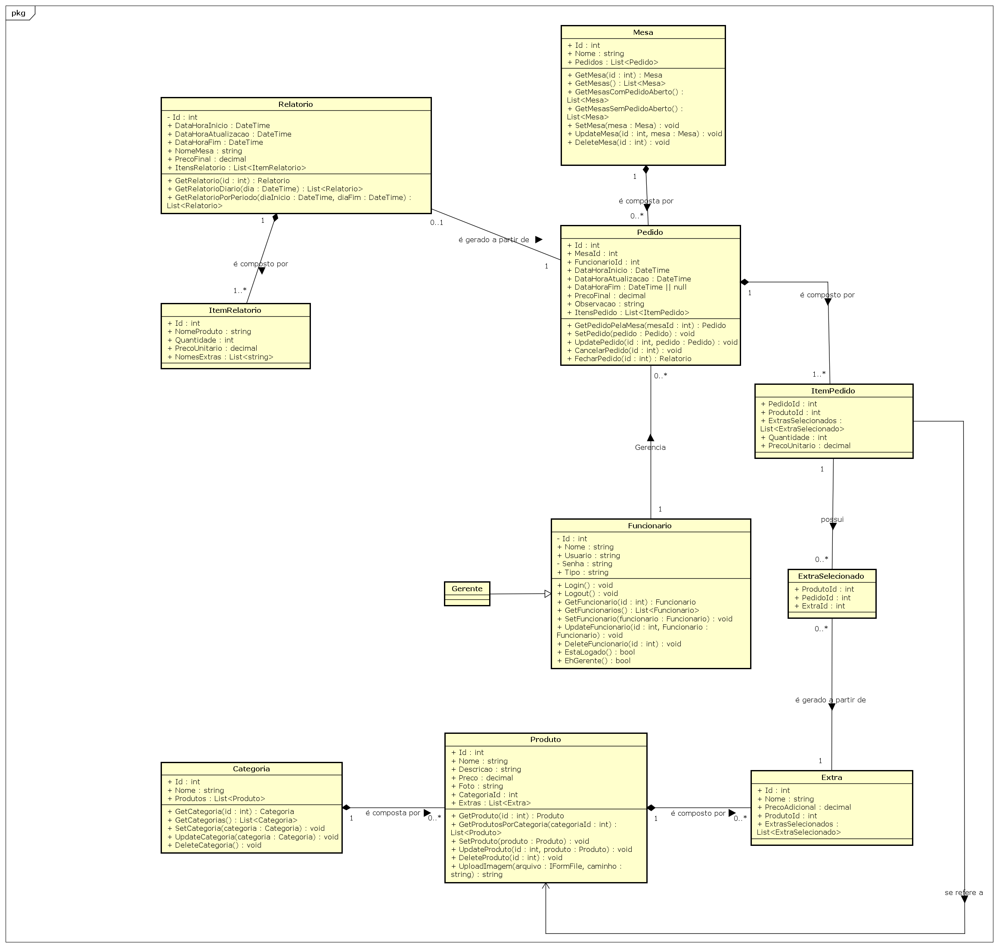

# Arquitetura da solução


## Fluxo de Atendimento

1. Garçom acessa a interface web em um dispositivo móvel.
2. Seleciona mesa e registra pedido (que o cliente escolhe pelo cardápio físico).
3. O pedido vai para a lista de pedidos
4. Os funcionários acessam a lista de pedidos e preparam o pedido do cliente
5. Os clientes pedem a conta, o caixa acessa a lista de pedidos, fecha o pedido e imprime a conta.
6. Ao final do dia o gerente gera o relatório diário e imprime.

## Diagrama de Classes



##  Modelo de dados

### Esquema relacional


---

### Modelo físico

Script de criação das tabelas do sistema:

```sql

CREATE DATABASE restaurante
USE restaurante;

CREATE TABLE Categorias (
  Id INT AUTO_INCREMENT PRIMARY KEY,
  Nome VARCHAR(100) NOT NULL
);

CREATE TABLE Produtos (
  Id INT AUTO_INCREMENT PRIMARY KEY,
  Nome VARCHAR(100) NOT NULL,
  Descricao VARCHAR(255) NOT NULL,
  Preco DECIMAL(10,2) NOT NULL,
  Foto VARCHAR(255) NOT NULL,
  CategoriaId INT NOT NULL,
  FOREIGN KEY (CategoriaId) REFERENCES Categorias(Id) ON DELETE CASCADE
);

CREATE TABLE Extras (
  Id INT AUTO_INCREMENT PRIMARY KEY,
  Nome VARCHAR(100) NOT NULL,
  PrecoAdicional DECIMAL(10,2) NOT NULL,
  ProdutoId INT NOT NULL,
  FOREIGN KEY (ProdutoId) REFERENCES Produtos(Id) ON DELETE CASCADE
);

CREATE TABLE Funcionarios (
  Id INT AUTO_INCREMENT PRIMARY KEY,
  Nome VARCHAR(100) NOT NULL,
  Usuario VARCHAR(50) NOT NULL,
  Senha VARCHAR(255) NOT NULL,
  Tipo VARCHAR(100) NOT NULL
);

CREATE TABLE Mesas (
  Id INT AUTO_INCREMENT PRIMARY KEY,
  Nome VARCHAR(50) NOT NULL
);

CREATE TABLE Pedidos (
  Id INT AUTO_INCREMENT PRIMARY KEY,
  MesaId INT NOT NULL,
  FuncionarioId INT NOT NULL,
  DataHoraInicio DATETIME NOT NULL,
  DataHoraAtualizacao DATETIME NOT NULL,
  DataHoraFim DATETIME,
  PrecoFinal DECIMAL(10,2) NOT NULL,
  Observacao VARCHAR(255) NOT NULL,
  FOREIGN KEY (MesaId) REFERENCES Mesas(Id) ON DELETE CASCADE,
  FOREIGN KEY (FuncionarioId) REFERENCES Funcionarios(Id) ON DELETE CASCADE
);

CREATE TABLE ItensPedido (
  Id INT AUTO_INCREMENT PRIMARY KEY,
  PedidoId INT NOT NULL,
  ProdutoId INT NOT NULL,
  Quantidade INT NOT NULL,
  PrecoUnitario DECIMAL(10,2) NOT NULL,
  FOREIGN KEY (PedidoId) REFERENCES Pedidos(Id) ON DELETE CASCADE,
  FOREIGN KEY (ProdutoId) REFERENCES Produtos(Id) ON DELETE CASCADE
);

CREATE TABLE ExtrasSelecionados (
  ProdutoId INT NOT NULL,
  PedidoId INT NOT NULL,
  ExtraId INT NOT NULL,
  PRIMARY KEY (ProdutoId, PedidoId, ExtraId),
  FOREIGN KEY (ExtraId) REFERENCES Extras(Id) ON DELETE CASCADE,
  FOREIGN KEY (ProdutoId, PedidoId) REFERENCES ItensPedido(ProdutoId, PedidoId) ON DELETE CASCADE
);

CREATE TABLE RelatorioPedidos (
  Id INT AUTO_INCREMENT PRIMARY KEY,
  DataHoraInicio DATETIME NOT NULL,
  DataHoraFim DATETIME NOT NULL,
  NomeMesa VARCHAR(100),
  NomeFuncionario VARCHAR(100),
  PrecoFinal DECIMAL(10,2) NOT NULL
);

CREATE TABLE ItensRelatorioPedidos (
  Id INT AUTO_INCREMENT PRIMARY KEY,
  RelatorioPedidoId INT NOT NULL,
  NomeProduto VARCHAR(100) NOT NULL,
  Quantidade INT NOT NULL,
  PrecoUnitario DECIMAL(10,2) NOT NULL,
  ExtrasSelecionados TEXT NOT NULL,
  FOREIGN KEY (RelatorioPedidoId) REFERENCES RelatorioPedidos(Id) ON DELETE CASCADE
);


```

## Tecnlogias utilizadas

### Front-end

| Dimensão                | Tecnologias      | Finalidade                                        |
| ----------------------- | ---------------- | ------------------------------------------------- |
| Framework Principal     | Angular          | Desenvolver a lógica do front-end                 |
| Framework CSS           | Bootstrap        | Componentes pré configurados                      |
| Gerenciamento de estado | NgRx             | Controle do estado da aplicação                   |
| Roteamento              | Angular Routing  | Navegação entre telas                             |
| Chamadas API            | Fetch API        | Comunicação com o Backend                         |
| IDE                     | VS Code / Neovim | Desenvolver com extensões para Angular/TypeScript |

### Back-end

| Dimensão        | Tecnologias           | Finalidade                                   |
| --------------- | --------------------- | -------------------------------------------- |
| Linguagem       | C#                    | Desenvolver a lógica de comunicação da API   |
| Framework       | ASP.NET               | Construção da API                            |
| Criptografia    | Bcrypt                | Hash de criptografia para a senha do usuário |
| ORM             | Entity Framework Core | Interface com o banco de dados               |
| IDE             | Neovim                | Desenvolvimento e teste                      |

### Banco de Dados

| Dimensão        | Tecnologias | Finalidade              |
| --------------- | ----------- | ----------------------- |
| Banco Principal | MySQL       | Armazenamento e relação |

## Hospedagem

| Dimensão       | Tecnologias      | Finalidade                                  |
| -------------- | ---------------- | ------------------------------------------- |
| Front-end      | Docker Container | Acesso localmente pelo localhost            |
| Back-end       | Docker Container | Comunicação com o front-end pela rede local |
| Banco de Dados | Docker Container | Hospedar o banco de dados localmente        |
| Instalação     | Inno Setup       | Script de instalação                        |

- **Front-end**: Armazenado em um docker container que sobe para a porta 8080, o usuário acessa o localhost:8080 e acessa a página.
- **Back-end**: Armazenado em um docker container que sobe para a porta 5000.
- **Banco de Dados**: Armazenado em um docker container e não é exposto a porta alguma, se comunica com o back-end pela rede interna do docker.
- **Instalação**: O script de instalação instala o Docker Desktop se ele não estiver instalado, executa o docker compose com o arquivo docker-compose.yaml do projeto e gera um atalho para o localhost:8080 na tela inical. 

## Qualidade do Software

Nossa equipe priorizou 6 das 8 características da norma ISO/IEC 25010, com foco nas necessidades do nosso projeto.

| Criterio | Aplicação no projeto |
| -------- | -------------------- |
| Usabilidade | Interface intuitiva para os funcionários (Botões grandes, feedback visual claro). |
| Desempenho | Aplicação simplificada, consultas otimizadas, containerização. |
| Segurança | Banco de dados não exposto à rede. Hash de senhas. |
| Portabilidade | Software containerizado, possui as próprias dependências internamente |
| Manutenibilidade | Código modularizado, documentação da API |
| Adequação Funcional | O software resolve o problema da gestão analógica ineficiente dos restaurantes |

